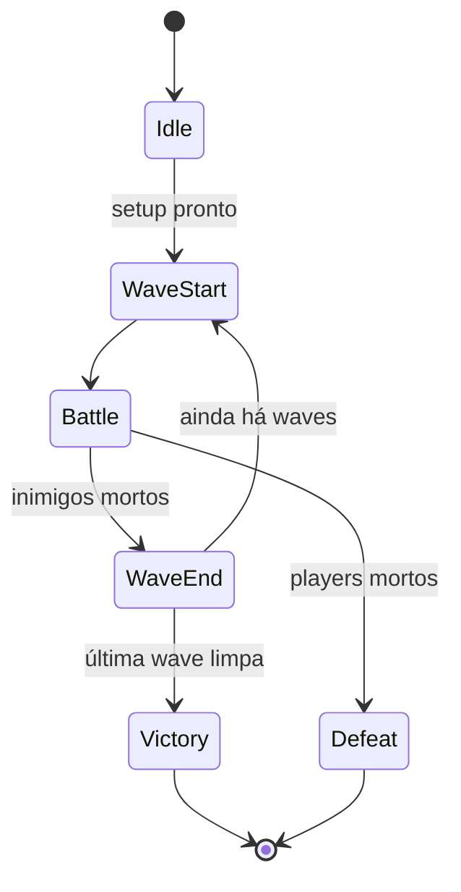
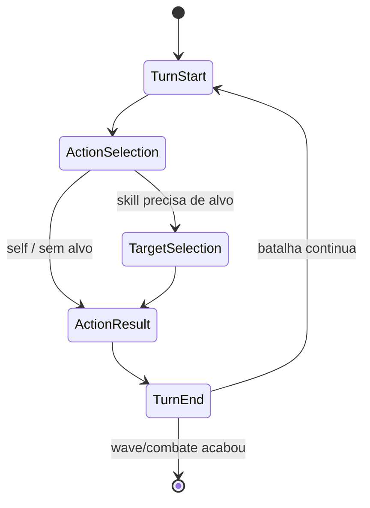

# 🏗️ Desenho de Arquitetura — Refactor do Combate
### Círculo dos Fragmentos
**Status:** RASCUNHO v0 · fundação da Fase 1 (refactor do slice)
**Companheiro:** `CirculoDosFragmentos_Slice_Contrato.md` (o slice define o alvo; este doc define a fundação)

---

## 1. Os quatro papéis

Toda a arquitetura se resume a separar quatro responsabilidades que hoje estão emboladas nos managers:

| Papel | Quem é | Natureza | Regra |
|---|---|---|---|
| **Verdade (dado)** | `CombatContext` | POCO, burro | guarda o estado, não decide nada |
| **Coordenação (fluxo)** | `CombatManager` | MonoBehaviour, singleton único | dispara a FSM e segura a coroutine raiz; sem lógica de combate dentro |
| **Fluxo detalhado** | Estados da FSM | POCO, só `Enter` | cada passo do combate, isolado no seu arquivo |
| **Cálculo (regras)** | Serviços | POCO, sem coroutine | pergunta-resposta instantânea, chamável de qualquer estado |

**Analogia:** o `CombatContext` é o *tabuleiro com as peças* (qualquer um olha e sabe a situação). O `CombatManager` é o *juiz* (sabe as regras, chama o próximo, mas não **é** o tabuleiro). Se o juiz virar o tabuleiro, não dá pra guardar o jogo numa caixa (= salvar expedição) nem mostrar o tabuleiro sem trazer o juiz (= testar sem cena).

---

## 2. As duas máquinas de estado

### 2.1 Máquina principal (fluxo lento — roda poucas vezes)

### 2.2 Sub-machine de Battle (fluxo rápido — repete por turno)

`Battle` é um estado da máquina de cima que **contém** a sub-machine. A máquina de cima não enxerga os estados de turno; a sub-machine não sabe que waves existem. Cada nível tem o seu próprio switch magro.

---

## 3. `CombatContext` — a verdade, campo a campo

POCO. Não é MonoBehaviour, não é singleton. Guarda **referências** a unidades cujo estado vital (HP/mana/buffs) conceitualmente pertence à camada de **expedição** acima. No slice, o combate é o único escopo, então o Context é um dono fininho — mas o desenho **não reseta vitais** no teardown de wave/combate.

Campos:
- `Units` — lista única de todas as unidades ativas (players + inimigos). **Substitui as três listas** de CombatManager/TurnManager/BuffSystem.
- `ActiveUnit` — de quem é o turno agora.
- `TurnData` — estado de AV por unidade (de onde sai a ordem da fila). Consultável por UI e por mecânicas de manipulação de AV.
- `CurrentWaveIndex` / `TotalWaves` — progresso de wave dentro do combate.
- `CurrentTurn` / `CurrentTurnActionValue` — contadores de rodada (migrados do TurnManager atual).

Consultas que outros sistemas fazem no Context (a "queryability" que a IA e as passivas futuras exigem): unidades vivas, players vivos, inimigos vivos, buffs de uma unidade (via `Units[i].ActiveBuffs`). Buffs **moram na unidade**; o Context dá o caminho até elas.

> **Nota de escopo (persistência):** o escopo de vida "persistente" (expedição) é **definido como estrutura, não implementado**. No slice, wave única = combate único; o Context não precisa atravessar combates ainda. Mas teardown nunca toca HP/mana/buff.

---

## 4. Os estados, e o que cada `Enter` faz

Cada estado é uma classe POCO com **só** `Enter` (sem `Tick`/`Exit` — coroutine cobre a espera). `Enter` dispara a coroutine quando precisa esperar tempo/animação, e ao terminar sinaliza a transição.

### Máquina principal

- **`Idle`** — pré-combate. Combate montado mas não começou; espera o setup popular o Context. *Não* é um estado de pausa-no-meio. → `WaveStart`.
- **`WaveStart`** — monta o próximo grupo de inimigos no Context (via serviço de setup de wave). Dispara notificação de início de wave (UI; e, no futuro, passivas tipo "+25% AV no início da wave"). → `Battle`.
- **`Battle`** — estado-container. Hospeda a sub-machine de turno e a roda até a wave acabar. Sem lógica própria além disso. → `WaveEnd` (inimigos mortos) ou `Defeat` (players mortos, sinalizado de dentro da sub-machine).
- **`WaveEnd`** — limpa o que é **da wave** — e nada de vitais (HP/mana/buff atravessam wave). Última wave? → `Victory`. Senão → `WaveStart`.
- **`Victory` / `Defeat`** — terminais. Disparam `OnCombatEnd(result)`. Teardown desliga a **fiação do combate** (inscrições, fila, seleção de alvo) sem tocar nos vitais — a expedição decide o que fazer com os sobreviventes.

### Sub-machine de Battle

- **`TurnStart`** — chama o serviço de ordenação por AV, define `ActiveUnit` (menor AV), recalcula. Aplica efeitos de início de turno (tick de buff `OnTurnStart`). → `ActionSelection`.
- **`ActionSelection`** — obtém a *intenção de ação*. Player → espera input (mouse/teclado + botão da skill). Inimigo → IA decide (slice: stub = básico). **Mesmo caminho, fonte diferente.** → `TargetSelection`, ou direto pra `ActionResult` se for self/sem alvo.
- **`TargetSelection`** — se a skill precisa de alvo, espera seleção (player) ou IA escolhe; valida via `TargetSystem`. Self/AOE podem pular. → `ActionResult`.
- **`ActionResult`** — executa a skill, resolve efeitos, trata mortes, espera animação nos pontos certos via coroutine. **O coração do combate.** (Ver seção 5.) → `TurnEnd`.
- **`TurnEnd`** — efeitos de fim de turno (buff `OnTurnEnd`), remove buffs expirados, avança contadores. Checa fim de wave/combate. → `TurnStart` (continua) ou sai da sub-machine.

---

## 5. `ActionResult` — o coração, e a fila de reação

Resolver uma ação não é linear no combate completo: skill bate → mata inimigo → morte dispara passiva de outro → passiva dá AV a um terceiro → talvez aplique buff que dispara nova reação. Tudo **dentro** de `ActionResult`, sem virar micro-estados.

O mecanismo que doma isso sem fatiar em estados é uma **fila de reação interna**:

1. A ação principal resolve e **empilha** as reações que disparou.
2. O estado processa a fila uma por uma.
3. Cada reação pode empilhar **novas** reações.
4. Repete até a fila esvaziar. **Só então** transiciona pra `TurnEnd`.

Isso dá ordem determinística (você sabe exatamente a sequência em que tudo resolveu) e mata o bug de **estado obsoleto** — o caso de "alguém morreu mas o passo seguinte ainda acha que está vivo", que é o que faz o combate atual parecer quebrado.

> **⚠️ Chamada de escopo (fila de reação):** a cadeia profunda é movida quase toda por **passivas**, que estão **OUT do slice**. Então este desenho deixa a **costura pronta** — `ActionResult` é construído já com o ponto onde a fila encaixa — mas a fila completa **não é implementada agora**. O slice só exige que `ActionResult` resolva a ação e trate morte de forma limpa. Mesmo princípio do escopo persistente vazio: porta aberta, máquina não construída antes da hora.

---

## 6. Serviços (cálculo puro, sem coroutine)

Chamáveis por qualquer estado. Recebem dados, devolvem resposta no mesmo frame.

- **Ordenação de turno por AV** — *novo*, extraído do `TurnManager`. Dado o AV de todos, devolve a ordem. Não espera nada.
- **`TargetSystem`** — *já existe*. Valida/lista alvos de uma skill.
- **`CombatCalculator`** — *já existe*. Calcula dano.
- **Setup de wave** — extraído do `WaveManager`/`CombatSetup`. Monta o próximo grupo de inimigos no Context.

---

## 7. Eventos — só notificação, nunca controle de fluxo

Com a FSM dirigindo o "quem chama quem e quando" pela **estrutura dos estados**, os eventos voltam ao papel certo: *avisar que algo aconteceu*. Quem escuta: UI (atualizar HUD, números de dano) e — no futuro — passivas reativas.

Um **mediator/event bus com escopo de combate** (instanciado, **não estático**) substitui os `static event` espalhados de hoje. Ele é construído porque o combate precisa de notificação limpa de qualquer jeito; e, de bônus, é onde as passivas vão plugar depois. **As passivas não são wiradas neste refactor** (OUT do slice).

---

## 8. Mapa de migração — onde cada manager de hoje cai

| Manager atual | Vira | Observação |
|---|---|---|
| `CombatManager` (atual) | dissolve em `ActionSelection` / `TargetSelection` / `ActionResult` | o **nome** é reusado pelo coordenador magro novo |
| `TurnManager` | serviço de ordenação + estados `TurnStart`/`TurnEnd`; AV/fila → Context | objeto some |
| `WaveManager` | estados `WaveStart`/`WaveEnd` + serviço de setup | objeto some (ou serviço fino) |
| `CombatSetup` | serviço de setup / transição `Idle → WaveStart` | — |
| `BuffSystem` | **refatorado** (ver seção 9); tick/remoção chamados por `TurnStart`/`TurnEnd` | buffs moram nas units, consultáveis via Context |
| `PassiveManager` | passivas plugam no mediator | **não wirado agora** (OUT do slice) |
| `GameManager` | fica | ciclo de vida acima do combate (`OnCombatStart/End`) |

O excesso comum a todos (setup, adiciona-evento, tira-evento, `Clear()` por wave) **evapora** — a FSM com transições explícitas substitui essa coordenação manual. De quebra, o `Clear()`-por-wave que limpava buff (errado, já que buff atravessa wave) deixa de existir.

---

## 9. Sub-tarefas marcadas (não detalhar aqui)

- **🔧 Redesenho interno dos buffs** — *sessão de design separada.* Refatorar buff é **decidir o comportamento desejado** do zero (modelo de stack, duração por stack, teto), não reorganizar código. É descoberta, merece foco próprio. Aqui só fica definido **onde** os buffs encaixam na FSM (seção 4/8).
- **🎨 Split `Unit` / `UnitView`** — remover `[RequireComponent(typeof(SpriteRenderer))]`, mover entrada (clique/teclado) e renderização pra `UnitView`, `Unit` vira POCO de lógica. Exigido pelo slice (3D) e pela persistência acima-de-cena.

---

## 10. Ordem sugerida de execução

Uma sequência que mantém o jogo rodável o máximo possível em cada passo:

1. **`CombatContext`** + migrar as três listas pra ele (uma fonte de verdade antes de tudo).
2. **Esqueleto das duas FSMs** com estados vazios que só transicionam (a máquina anda, sem lógica).
3. **Mover lógica manager → estado**, um estado por vez, lendo/escrevendo no Context.
4. **Mediator** no lugar dos static events (notificação).
5. **Split `Unit`/`UnitView`** + `Animator` (entra o 3D/proxy).
6. **Refactor dos buffs** (sessão de design própria antes).
7. *(bônus, tempo ocioso)* testes do núcleo reconstruído.

---

## 11. O que este refactor NÃO faz

- Persistência de expedição (escopo persistente fica vazio)
- Passivas (mediator existe; não são wiradas)
- Fila de reação completa (costura pronta; não implementada)
- IA além do stub atual
- Testes automatizados (bônus pós-refactor, fora do "temos que fazer")
